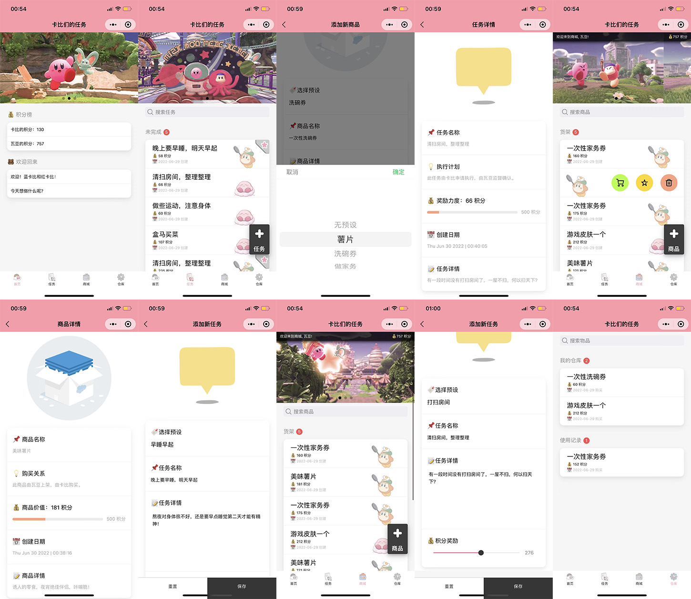
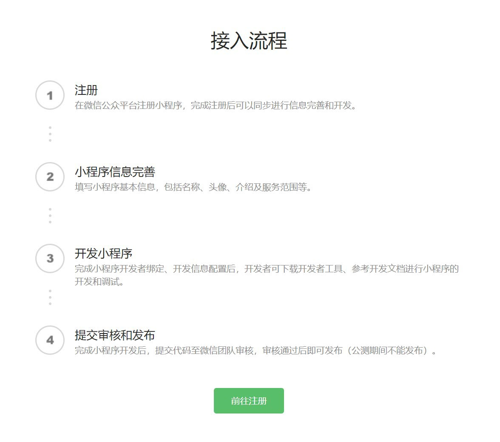
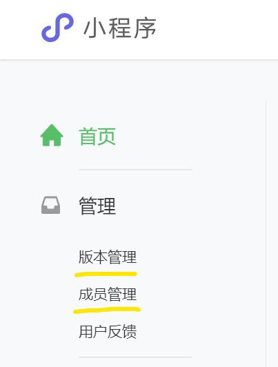
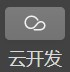
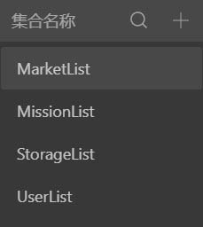
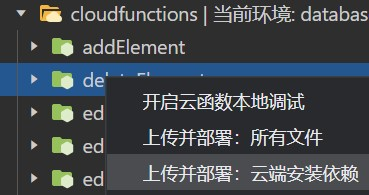
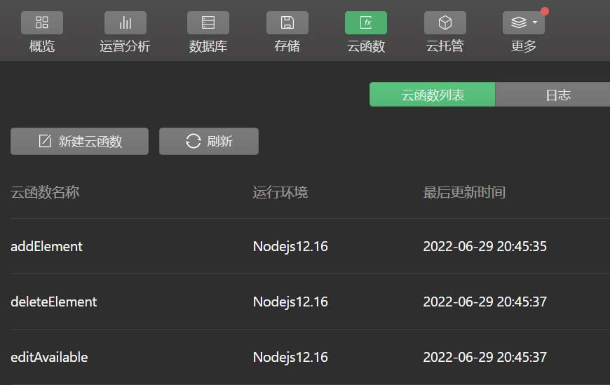
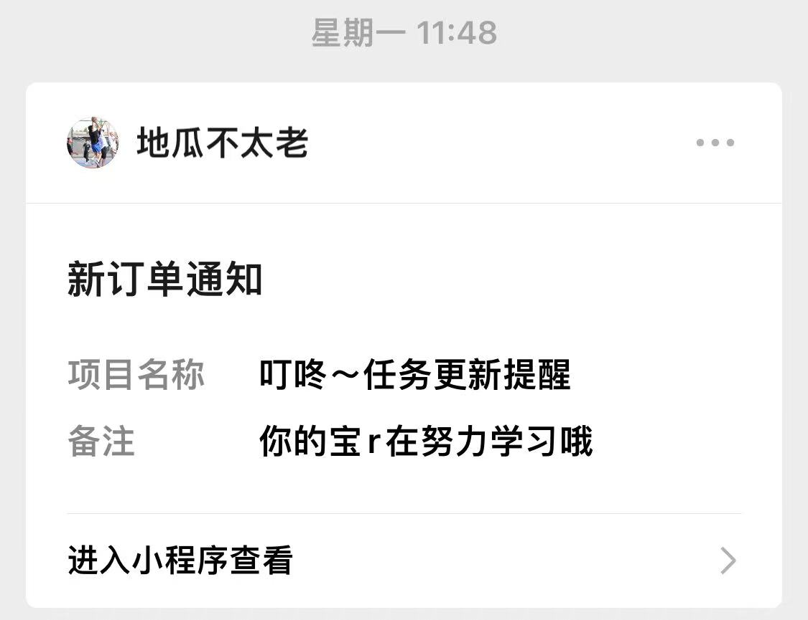
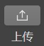
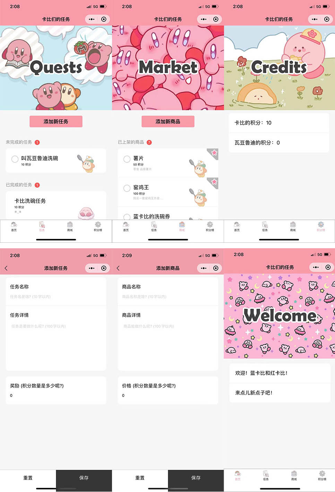

# 云开发情侣互动小程序（做任务，攒积分，换商品）
## 序言
这是使用云开发能力构建的情侣互动小程序，可以跟女朋友互动哦，其中使用了云开发基础能力的使用：
- **数据库**：对文档型数据库进行读写和管理
- **云函数**：在云端运行的代码，开发者只需编写业务逻辑代码
## 使用逻辑
打个比方:
- 女朋友发布任务->女朋友来做任务->做完后由你来确认完成->女朋友收到积分
- 你发布商品(洗碗券)->女朋友使用积分购买->商品进入到女朋友的库存->女朋友拿着洗碗券叫你洗碗->你洗碗->女朋友将物品(洗碗券)标记为已使用(不可逆)
- 这样做的原因是 不想给任何一方能自说自话 增加自己或者对方积分的能力[点击完成任务的人不能是获得积分的人也不能是自己]
## 版本新增
- 将所有非云函数的云逻辑**封装为云函数**
- 新增了**仓库系统**，购买了的商品会存入仓库，然后再被使用
- 新增了**搜索框**，可以搜索物品和任务
- 新增了**滑动窗**，可以自动播放显示多张图片
- 新增了**商品和任务预设**，添加商品或任务可以使用预设，非常迅速
- 将新增按钮变为可拖拽的**页面悬浮按钮**
- 购买，上架，新建任务的**时间都会被记录**并显示
- 取消了点击左边圆圈来完成或者购买，统一改为**左滑菜单**
- 左滑菜单统一用**图标**显示，更加精简
- 使用**特效升级**了详细信息页面与添加页面的美观度
- 添加任务或物品界面积分文本框改为**滑块**
- 在商城添加了**顶栏**显示积分，更直观
- 使用**表情符号**简单的增加了美感
## 效果图与动画
>
>
## 部署方式
- 在这里注册小程序开发者: https://mp.weixin.qq.com/cgi-bin/wx
- 在这里登录开发者账号: https://mp.weixin.qq.com/
>
- 登录之后先在`主页`完成小程序`信息`和`类目`
- 然后可以在`管理`中的`版本管理`与`成员管理`中发布小程序体验版并邀请对象使用
>
- 随后可以在`开发`中的`开发工具`里下载**微信开发者工具**
- 打开微信开发工具->登录->导入我的文件夹-进入工具
- 在左上角五个选项中选择`云开发`->按照提示开通云开发(这里可以选择免费的，不过限量，我开发用的多，6块够用了)
>
- 进入后点击数据库->在集合名称添加四个集合：`MarketList`, `MissionList`, `StorageList`, `UserList`
- 之前使用过上一个版本的，需要清空所有数据，因为字段结构不一样
>
- 在`UserList`中添加两个默认记录, 在两个记录中分别添加两个字段:
```
字段 = _openid | 类型 = string | 值 = 先不填
字段 = credit | 类型 = number | 值 = 0
```
- 打开云开发的控制台的`概览`选项->复制环境ID
- 打开 `miniprogram/envList.js` 将内容全部替换成如下，注意替换环境ID
```js
module.exports = {
  envList: [{
    envId:'上述步骤中你获得的环境ID (保留单引号)'
  }]
}
```
- 右键点击 `cloudfunctions` 中的每个文件夹并选择云函数云端安装依赖上传 (有点麻烦但是这是一定要做的)
>
- 如果云开发里面的云函数页面是这样的就是成功了
>

- 没有安装npm或者NodeJs, 需要先在这里安装: https://nodejs.org/dist/v16.15.1/node-v16.15.1-x64.msi
- 安装好的，就直接运行`cloudfunctions/Install-WX-Server-SDK.bat` 
- 不成功的话可以在命令行输入 `npm install --save wx-server-sdk@latest`
- 然后创建体验版小程序->通过开发者账号分享到女朋友手机上(要先登录小程序开发者账号)
- 在两个手机上运行小程序->分别在两个手机上的小程序里新建任务
- 然后回到云开发控制台的`missionlist`数据库集合->找自己和女朋友的`_openid`变量并记录
- 把这两个记录下来的`_openid`拷贝到云开发控制台`UserList`数据集合里刚刚没填的`_openid`变量中
- 把这两个记录下来的`_openid`拷贝到`miniprogram/app.js`里的`_openidA`和`_openidB`的值里(A是卡比，B是瓦豆)
- 在`miniprogram/app.js`里把`userA`和`userB`改成自己和女朋友的名字
- 然后再试试看是不是成功了! (别忘了任务和物品**左滑**可以完成和购买)
- 消息提醒功能：
- 参考https://blog.csdn.net/hell_orld/article/details/110675777?ops_request_misc=%257B%2522request%255Fid%2522%253A%2522168490366016800180699170%2522%252C%2522scm%2522%253A%252220140713.130102334..%2522%257D&request_id=168490366016800180699170&biz_id=0&utm_medium=distribute.pc_search_result.none-task-blog-2~all~sobaiduend~default-2-110675777-null-null.142^v87^insert_down28v1,239^v2^insert_chatgpt&utm_term=%E5%BE%AE%E4%BF%A1%E5%B0%8F%E7%A8%8B%E5%BA%8F%E9%80%9A%E7%9F%A5%E4%BA%91%E5%BC%80%E5%8F%91&spm=1018.2226.3001.4187配置自己想要的模板
- 在`miniprogram/pages/MainPage/index.js`和`miniprogram/pages/MissionAdd/index.js`里把模板号换成自己想要的模板号
- 在`cloudfunctions/information/index.js`里把UserA和UserB的openid值进行修改就能使用消息提醒功能了
>
- 别忘了最后点击右上角上传->然后在开发者账号上设置小程序为**体验版**->不用去发布去审核
>
- 最后如果有兴趣可以继续深入开发, 开发文档: https://developers.weixin.qq.com/miniprogram/dev/component/
## 旧版效果图
>
## 声明
- 小程序内所有图片均来自网络，此项目非商用，侵删。
- 若想使用此项目为商用，请先告知我，谢谢。
